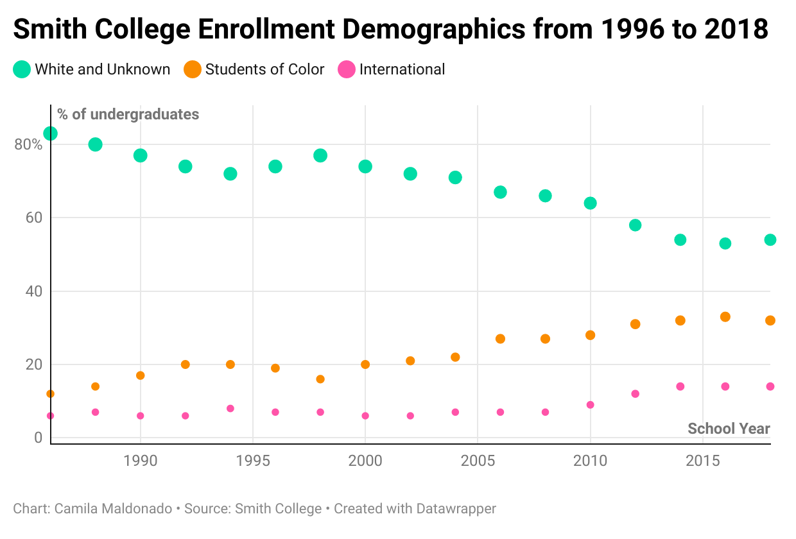

## “To foster trust and respect in a diverse community”
As an international student coming from Paraguay, I am considered and identify myself as a Latina student. That label also implies that I am considered a person of color, yet my skin does not truly fit within this label. So, I decided to look at some data provided by the Institutional Research at Smith to go over how the numbers have changed over time. 

Data shows that my college has been doing a great job building a truly diverse campus, yet as it always needed to say, we can do better. 
This diversity should also be seen when looking at sports events, when inviting guests to campus, bringing alumni to conferences on campus, and even when hiring new faculty members. Not mentioning the order in which the donation web page showcases “Emergency Funds for Students of Color” as the last option… 
Personally, I believe that accepting more students from other ethnic backgrounds is a progressive action, but the place to which these people are brought should offer more equal opportunities as the white students get. I would like to hear more about those Latinx students who worked so hard to graduate, the stories of those who traveled thousands of miles to get here, and those who have to deal with uncomfortable sights every day.
Diversity should matter not only in catalogs but in real life as well. 

